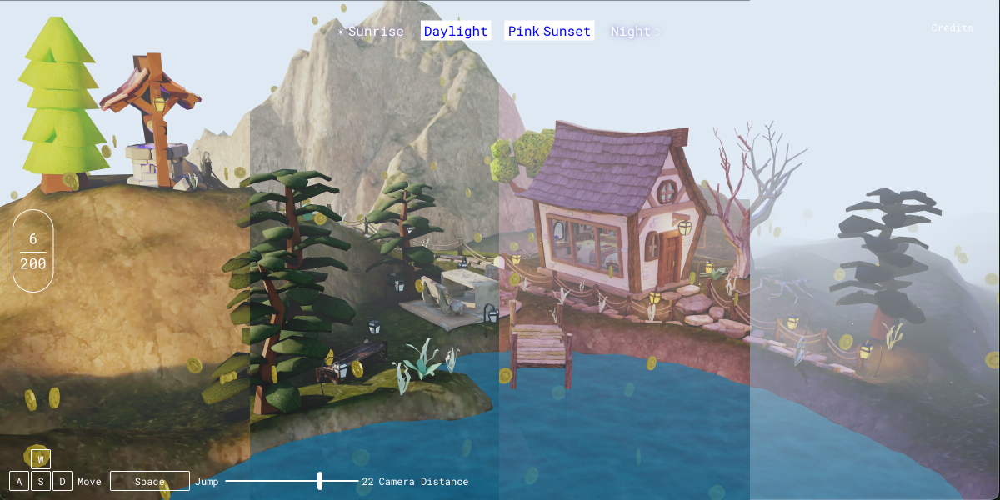
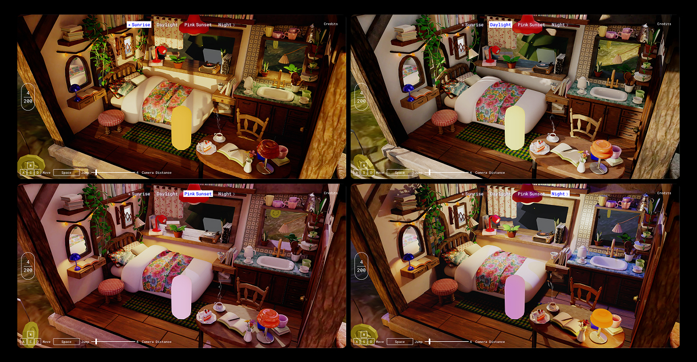
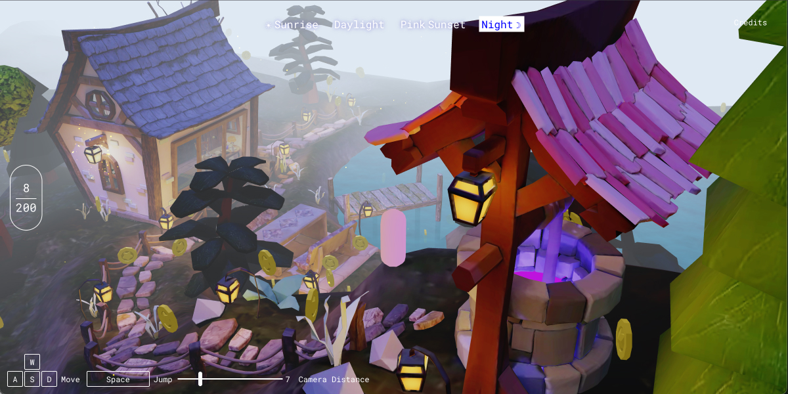
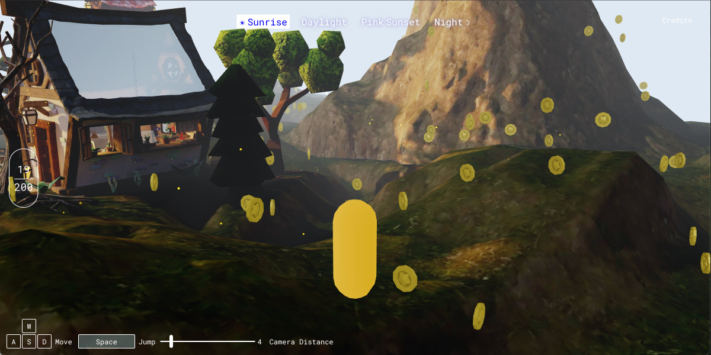
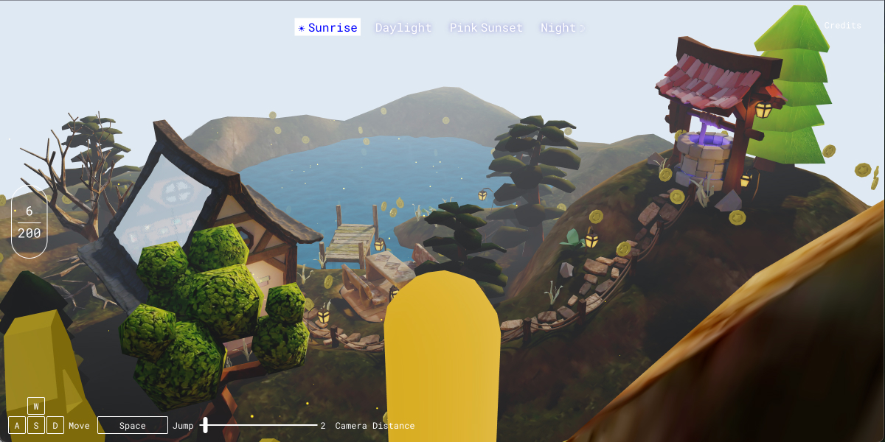
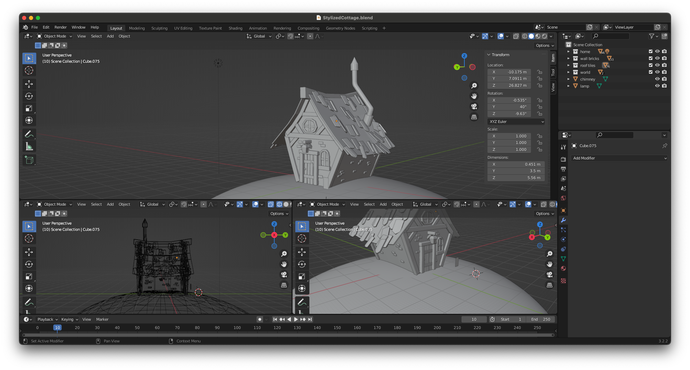
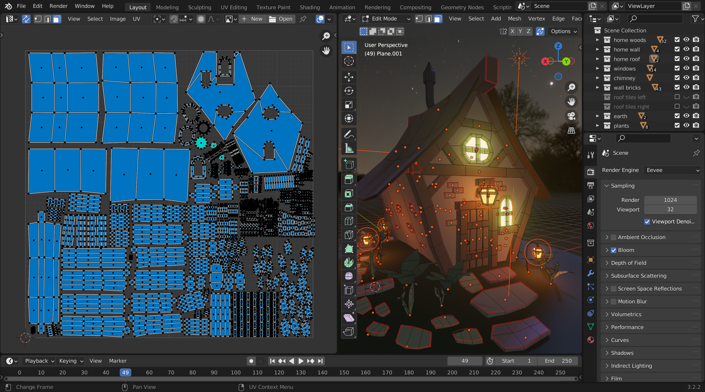

# Mistwood Cottage : A Story in the Hills

> _Fog drapes over the hillside like a memory — soft, shifting, never fully still. In the heart of it all stands a solitary cottage, hiding a simple life of comfort._

Mistwood Cottage is a cozy, interactive 3D experience built with WebGL and Three.js, where players can wander through a hand-crafted stylized world of hills, fog, and simple pleasures. With dynamic day-night cycles, atmospheric shaders, peaceful interiors, and playful exploration mechanics, it’s a space designed for calm immersion and quiet storytelling.

> [ 🌐 Live Demo](https://mistwood-cottage.vercel.app) | [🐦 Twitter (X)](https://x.com/amiradeuraseh)

## Features

-   🏡 Cottage Life:
    -   Explore a lovingly detailed interior complete with a cozy bedroom, work desk, and kitchen nook.
    -   Redesigned cottage architecture with larger windows to invite more natural lights and scenic views.
-   🌅 Dynamic Day-Night Cycle:
    -   Smooth transitions between sunrise, daylight, sunset, and night scenes.
    -   Each texture comes with its own unique mood and atmosphere.
-   🌳 Natural Environment:
    -   Scenic terrain with hills, mountains and ponds.
    -   Environmental elements like trees, a mysterious well, cobblestone paths, and outdoor seatings.
-   💫 Rich Visual Effects:
    -   Custom shaders to bring the world to life: fog, glowing fireflies, realistic water and acoustics and tea steam.
    -   Reflective mirror, dusty windows and refractive roof glass details add depth and realism.
-   🕹️ Player Exploration:
    -   Third-person character movement with responsive physics around terrain.
    -   Adjustable camera distance with a UI slider for the perfect view.
-   🎵 Immersive Sound Design:
    -   Dynamic ambient sounds that changes with your surroundings: summer insects outdoors, cozy jazz tunes indoors and underwater echoes.
    -   Player sounds: footsteps on wood, soft grass crunching, splashing water, playful jump effect and joyful coin collection.
-   🪙 Lighthearted Gameplay:
    -   A simple coin collection mini-game encourages player to explore the world.
-   👆 Cursor Interaction:
    -   Peek inside by toggling the cottage's front and left walls.
    -   Pan the camera with hold-and-drag controls that changes player's moving direction.

## 🖼️ Gallery

🛌 A cozy small room in different day cycle textures.

🔮 A mysterious well on top of a small hill.

⛰️ Player collecting coins while exploring the land.

🌞 Sunrise from the mountain summit overseeing home.

## 🚧 Roadmap / Todo

-   [ ] Fix physics inconsistency causing uneven player movement and jump behavior across browsers and devices.
-   [ ] Introduce subtle story moments and narrative touchpoints across the terrain.
-   [ ] Add more interactive elements and relaxing mini games to encourage deeper exploration.
-   [ ] In-game photo mode to capture scenic views.
-   [ ] Redesign the water shader from a realistic to a stylized look that better complements the world.
-   [ ] Improve visual cues to indicate that the cottage walls can be toggled.

## 🧩 Tech Stack

-   [Three.js](https://threejs.org/) : 3D rendering
-   [Rapier3D](https://rapier.rs/docs/user_guides/javascript/getting_started_js) : Physics engine
-   [lil-gui](https://lil-gui.georgealways.com) : Debugging tool
-   [stats-gl](https://github.com/RenaudRohlinger/stats-gl) : Monitoring FPS, CPU and GPU performance
-   [Vite](https://vite.dev) : Frontend build tooling
-   [GSAP](https://gsap.com) : Animation library
-   [Vercel](https://vercel.com) : Deployment
-   [Sass](https://sass-lang.com) : Styling

## 🏆 Credits

This project would not be possible without the teachings, resources and inspirations from many amazing developers and designers.

-   Three.js & GLSL Shader
    -   Code structuring from [Three.js Journey](https://threejs-journey.com/lessons/code-structuring-for-bigger-projects) by [Bruno Simon](https://x.com/bruno_simon)
    -   Coffee smoke shader from [Three.js Journey](https://threejs-journey.com/lessons/coffee-smoke-shader) by [Bruno Simon](https://x.com/bruno_simon)
    -   [Realistic Water shader](https://youtu.be/jK4uXGY07vA) by [Dan Greenheck](https://www.youtube.com/@dangreenheck)
    -   [Third Person Camera](https://github.com/brunosimon/infinite-world/blob/master/sources/Game/State/CameraThirdPerson.js) from [Infinite World](https://infinite-world.vercel.app/) by [Bruno Simon](https://x.com/bruno_simon)
    -   Mirror shader with [Three.js Reflector](https://threejs.org/examples/?q=mirror#mirror)
    -   Roof glass shader with [Three.js Refractor](https://threejs.org/examples/?q=refraction#webgl_refraction)
    -   Player movement with [Rapier Character Controller](https://rapier.rs/docs/user_guides/javascript/character_controller/)
    -   [Texture transition shader](https://jsfiddle.net/prisoner849/bmda176z/) based on [Paul West (@prisoner849)](https://discourse.threejs.org/u/prisoner849)
-   3D Modelling Tutorials
    -   Cottage - [Lowpoly Stylized Cottage](https://youtu.be/izjz2Hya2QM) by [Grant Abbitt](https://www.youtube.com/@grabbitt)
    -   Trees - [Low Poly Trees](https://youtu.be/p-9pgZI3inI) by [Grant Abbitt](https://www.youtube.com/@grabbitt)
    -   Well - [Low Poly Well](https://youtu.be/QPh8h0hWkg0) by [Grant Abbitt](https://www.youtube.com/@grabbitt)
    -   Room Interiors - [3D Isometric Bedroom](https://youtu.be/J6b_pcAX1TQ) by [art by tran](https://www.youtube.com/@artbytran_)
    -   Cake - [Model a Piece of Cake](https://youtu.be/uR2zcJRNqts) by [sofya making art](https://www.youtube.com/@sofyamakingart)
    -   Strawberry - [Cute Breakfast Scene](https://youtu.be/Uh2lBnh4X4M) by [Chunky Pancakes Art](https://www.youtube.com/@chunkypancakesart)
    -   Ropes - [Cozy Winter Wonderland](https://youtu.be/E3WWj_m19dM) by [Grant Abbitt](https://www.youtube.com/@grabbitt)
-   Tools & Resources
    -   Wooden dock model - [Medieval Fantasy Props](https://chuckcg.gumroad.com/l/ulfkzi) by [ChuckCG](https://chuckcg.gumroad.com/)
    -   Coin model - [Coin](https://poly.pizza/m/QHZtj94fvh) by [Quaternius](https://poly.pizza/u/Quaternius)
    -   Materials - [BlenderKit](https://www.blenderkit.com/)
    -   UV unwrapping - [UVPackMaster3](https://uvpackmaster.com/) by [glukoz (3Coords)](https://x.com/glukozUVP)
    -   Terrain design - [Txa Landscape](https://github.com/nerk987/txa_ant/releases/tag/v4.00.0) by [ChuckCG](https://youtu.be/FOMmvspCcQk)
    -   Cursor icons - [Cursor Pack](https://kenney.nl/assets/cursor-pack) by [KENNEY](https://kenney.nl/)
-   Sound Effects
    -   Cursor click from [Interface Sounds](https://kenney.nl/assets/interface-sounds) by [KENNEY](https://kenney.nl/)
    -   [Walking through grass](https://pixabay.com/sound-effects/walking-through-grass-80308/) by [freesound_community](https://pixabay.com/users/freesound_community-46691455/)
    -   [Footsteps on wood floor](https://pixabay.com/sound-effects/footsteps-on-wood-floor-14735/) by [freesound_community](https://pixabay.com/users/freesound_community-46691455/)
    -   [Walking in water](https://pixabay.com/sound-effects/walking-in-water-199418/) by [Alex_Jauk](https://pixabay.com/users/alex_jauk-16800354/)
    -   [Summer insects](https://pixabay.com/sound-effects/summer-insects-243572/) by [Soul_Serenity_Sounds](https://pixabay.com/users/soul_serenity_sounds-6817262/)
    -   [Jazz waltz](https://pixabay.com/sound-effects/loop-file-jazz-waltz-34-beat-bpm132-144689/) by [ShidenBeatsMusic](https://pixabay.com/users/shidenbeatsmusic-25676252/)
    -   [Underwater while scuba diving](https://pixabay.com/sound-effects/under-water-sounds-while-scuba-diving-14866/) by [freesound_community](https://pixabay.com/users/freesound_community-46691455/)
    -   [Cartoon jump](https://pixabay.com/sound-effects/cartoon-jump-6462/) by [freesound_community](https://pixabay.com/users/freesound_community-46691455/)
    -   [Coin](https://pixabay.com/sound-effects/coin-257878/) by [chieuk](https://pixabay.com/users/chieuk-46505609/)

## 🕰️ Previous Version (v1.0.0)

