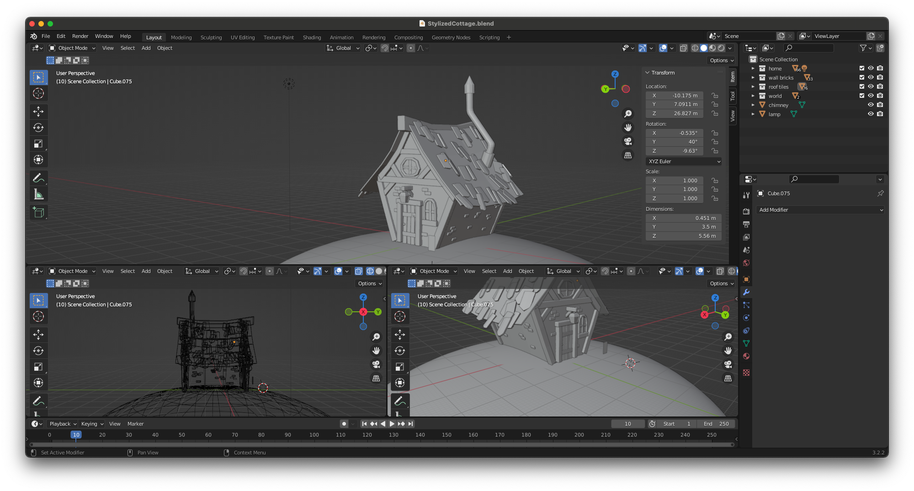

# Stylized Cottage

An unfinished work of a stylized cottage 🏡 Sometimes, it's better to close the chapter on a long-time project and move forward 😓 Still, grateful for what I learned along the way!

## Showcase

How it started

UV map texture

## Todo

-   Fix roof UV texture map
-   Add physics on the roof
-   Add roof tiles falling from top on user click
-   Change cottage walls plane -> mesh for double sided
-   Animate grass and plants
-   Add clouds coming out from chimney
-   Add fireflies on the door lamp
-   Add smooth camera animation
-   Fix fog to more natural
-   Add loading scene
-   Model performace enhancement

## References

-   Cottage model created in Blender with tutorial from [Grant Abbitt](https://www.youtube.com/watch?v=izjz2Hya2QM&list=PLn3ukorJv4vsPA95G7jTHDHixF5FntFm3&index=1)
